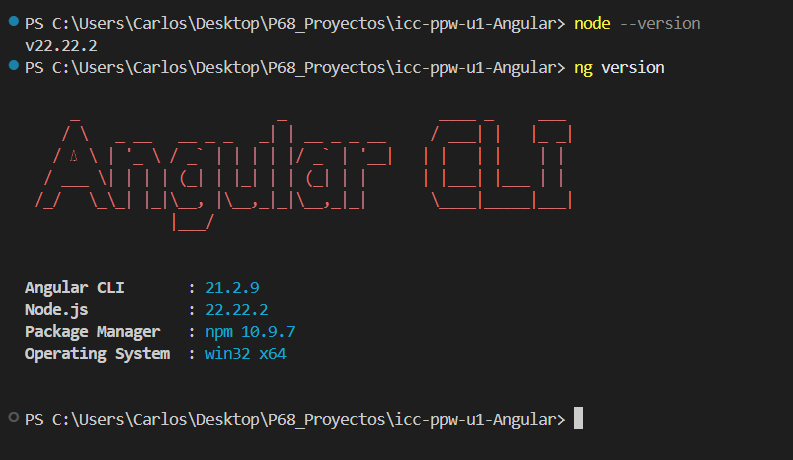
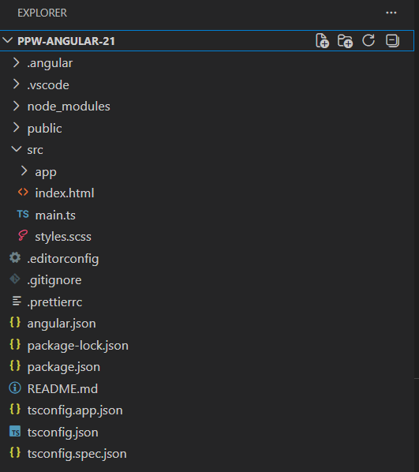
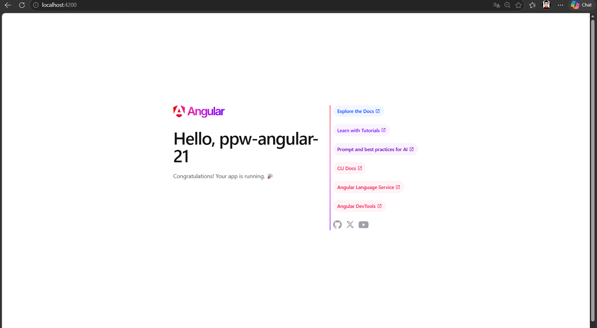
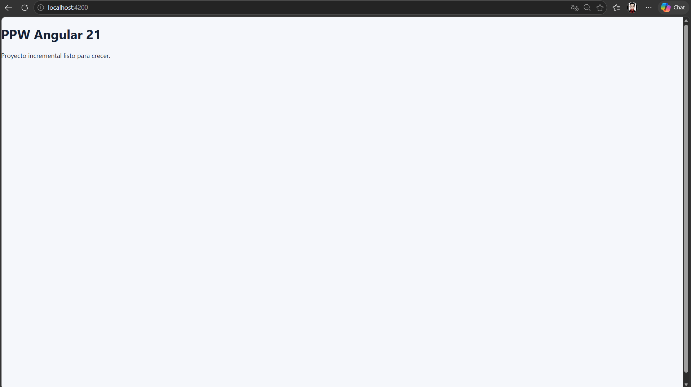

# Práctica 01: Instalación y Configuración del Entorno - Angular

## 📌 Información General

- **Título:** Instalación y Configuración del Entorno
- **Asignatura:** Programación y Plataformas Web
- **Carrera:** Ingeniería en Computación
- **Estudiante:** Carlos Antonio Gordillo Tenemaza
- **Semestre:** 5to Semestre

---

## 🛠️ Descripción

Este proyecto consiste en la creación del proyecto incremental `ppw-angular-21` utilizando Angular 21, con routing habilitado y una estructura de carpetas basada en features. La aplicación sirve como una base inicial, limpia y mantenible, que no es un ejercicio aislado, sino el mismo proyecto que crecerá y se expandirá progresivamente en los módulos 02, 03, 04 y posteriores.

Se configuró un entorno minimalista, eliminando el boilerplate por defecto de Angular CLI, simplificando el componente raíz y estableciendo estilos globales básicos.

---

## 💻 Fragmentos de Código Destacado

### 1. Creación del proyecto base
El comando inicial utilizado para generar la estructura con Angular CLI, forzando el uso de SCSS y deshabilitando Server Side Rendering (SSR):
```bash
ng new ppw-angular-21 --routing --style=scss --ssr=false
cd ppw-angular-21
pnpm install
pnpm start
```

### 2. Configuración del Enrutamiento (app.routes.ts)
Definición de la ruta inicial hacia `HomePage` y configuración de un `wildcard ()` para redirigir cualquier URL desconocida a la página principal, previniendo pantallas en blanco:
```TypeScript
import { Routes } from '@angular/router';
import { HomePage } from './features/home/pages/home-page';

export const routes: Routes = [
  {
    path: '',
    component: HomePage,
  },
  {
    path: '**',
    redirectTo: '',
  },
];
```


### 3. Simplificación del Componente Raíz (app.html y app.ts)
Reducción del componente raíz para que funcione únicamente como un contenedor `(app-shell)` que renderiza el contenido dinámico a través de `RouterOutlet`:  
```HTML
<main class="app-shell">
  <router-outlet />
</main>
```


### 4. Configuración Global Standalone (app.config.ts)
Uso de la API standalone de Angular 21 (sin `AppModule`) para proveer el enrutamiento y la detección de cambios de zona, preparando el archivo para futuros proveedores como `provideHttpClient`:   
```TypeScript
import { ApplicationConfig, provideZoneChangeDetection } from '@angular/core';
import { provideRouter } from '@angular/router';
import { routes } from './app.routes';

export const appConfig: ApplicationConfig = {
  providers: [
    provideZoneChangeDetection({ eventCoalescing: true }),
    provideRouter(routes),
  ],
};
```

---

## 🧑‍💻 Capturas de Pantalla

### 1. Versión de Angular
**Descripción:** Salida del comando `ng version` en la terminal, validando que se está utilizando Angular CLI en su versión 21 o superior.



### 2. Creación del Proyecto
**Descripción:** Proceso de creación del proyecto en la terminal utilizando Angular CLI con los flags correspondientes para routing y estilos SCSS.



### 3. Página de Inicio por Defecto
**Descripción:** Captura de la página de bienvenida original generada por Angular CLI antes de realizar las modificaciones y la limpieza del boilerplate.



### 4. HomePage Funcionando
**Descripción:** Resultado final ejecutándose en `http://localhost:4200`, donde se observa el componente `HomePage` renderizado correctamente a través de la ruta raíz `/`.


